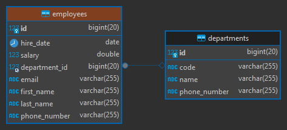

# [Spring Data JPA -Criteria Queries - The Full Guide](https://www.youtube.com/watch?v=qpSasUow1XI&t=24s)

- Tutorial tomado el canal de **Bouali Ali**
- [Proyecto donde se usa Specifications como capa superior de Criteria API](https://github.com/magadiflo/spring-boot-web-crud.git )

---

## Dependencias

````xml
<!--Spring Boot 3.2.3-->
<!--Java 21-->
<dependencies>
    <dependency>
        <groupId>org.springframework.boot</groupId>
        <artifactId>spring-boot-starter-data-jpa</artifactId>
    </dependency>
    <dependency>
        <groupId>org.springframework.boot</groupId>
        <artifactId>spring-boot-starter-web</artifactId>
    </dependency>

    <dependency>
        <groupId>com.mysql</groupId>
        <artifactId>mysql-connector-j</artifactId>
        <scope>runtime</scope>
    </dependency>
    <dependency>
        <groupId>org.projectlombok</groupId>
        <artifactId>lombok</artifactId>
        <optional>true</optional>
    </dependency>
    <dependency>
        <groupId>org.springframework.boot</groupId>
        <artifactId>spring-boot-starter-test</artifactId>
        <scope>test</scope>
    </dependency>
</dependencies>
````

## Configuraciones

````yaml
server:
  port: 8080
  error:
    include-message: always

spring:
  application:
    name: spring-data-jpa-criteria-queries

  datasource:
    url: jdbc:mysql://localhost:3306/db_spring_data_jpa
    username: admin
    password: magadiflo

  jpa:
    hibernate:
      ddl-auto: create-drop
    properties:
      hibernate:
        format_sql: true

logging:
  level:
    org.hibernate.SQL: DEBUG
````

## Entidades

````java

@NoArgsConstructor
@AllArgsConstructor
@Builder
@Data
@Entity
@Table(name = "employees")
public class Employee {
    @Id
    @GeneratedValue(strategy = GenerationType.IDENTITY)
    private Long id;
    private String firstName;
    private String lastName;
    private String email;
    private String phoneNumber;
    private LocalDate hireDate;
    private Double salary;

    @ManyToOne
    @JoinColumn(name = "department_id")
    private Department department;
}
````

````java

@NoArgsConstructor
@AllArgsConstructor
@Builder
@Data
@Entity
@Table(name = "departments")
public class Department {
    @Id
    @GeneratedValue(strategy = GenerationType.IDENTITY)
    private Long id;
    private String code;
    private String name;
    private String phoneNumber;
}
````

## Tablas generadas



## Repositorios

````java
public interface IEmployeeRepository extends JpaRepository<Employee, Long> {
}
````

````java
public interface IDepartmentRepository extends JpaRepository<Department, Long> {
}
````

## Controladores

````java

@RequiredArgsConstructor
@RestController
@RequestMapping(path = "/api/v1/employees")
public class EmployeeRestController {

    private final IEmployeeRepository employeeRepository;

    @GetMapping
    public ResponseEntity<List<Employee>> getAllEmployees() {
        return ResponseEntity.ok(this.employeeRepository.findAll());
    }

    @GetMapping(path = "/{employeeId}")
    public ResponseEntity<Employee> getEmployee(@PathVariable Long employeeId) {
        return this.employeeRepository.findById(employeeId)
                .map(ResponseEntity::ok)
                .orElseGet(() -> ResponseEntity.notFound().build());
    }
}
````

````java

@RequiredArgsConstructor
@RestController
@RequestMapping(path = "/api/v1/departments")
public class DepartmentRestController {

    private final IDepartmentRepository departmentRepository;

    @GetMapping
    public ResponseEntity<List<Department>> getAllEmployees() {
        return ResponseEntity.ok(this.departmentRepository.findAll());
    }

    @GetMapping(path = "/{departmentId}")
    public ResponseEntity<Department> getEmployee(@PathVariable Long departmentId) {
        return this.departmentRepository.findById(departmentId)
                .map(ResponseEntity::ok)
                .orElseGet(() -> ResponseEntity.notFound().build());
    }
}
````

**ATENCIÓN**

> Por tema de desarrollo rápido del tutorial, es que uso directamente el `repository` en los controladores, pero en un
> desarrollo real, con buenas prácticas, se debería usar la capa de `service`.

## Ejecutando y probando endpoints

Lista de empleados:

````bash
$ curl -v http://localhost:8080/api/v1/employees | jq

>
< HTTP/1.1 200
<
[
  {
    "id": 1,
    "firstName": "Martín",
    "lastName": "Almagro",
    "email": "almagro@gmail.com",
    "phoneNumber": "963258969",
    "hireDate": "2015-03-01",
    "salary": 5000,
    "department": {
      "id": 1,
      "code": "D01",
      "name": "Sistemas",
      "phoneNumber": "332636"
    }
  },
  {...},
  {
    "id": 11,
    "firstName": "Judith",
    "lastName": "Alegría",
    "email": "ciro@gmail.com",
    "phoneNumber": "943851697",
    "hireDate": "2015-03-29",
    "salary": 5455,
    "department": {
      "id": 5,
      "code": "D05",
      "name": "Soporte",
      "phoneNumber": "321478"
    }
  }
]
````

Lista de departamentos:

````bash
$ curl -v http://localhost:8080/api/v1/departments | jq

>
< HTTP/1.1 200
[
  {
    "id": 1,
    "code": "D01",
    "name": "Sistemas",
    "phoneNumber": "332636"
  },
  {...},
  {
    "id": 5,
    "code": "D05",
    "name": "Soporte",
    "phoneNumber": "321478"
  }
]
````
